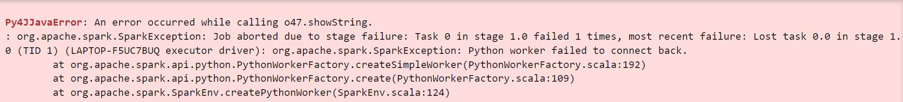
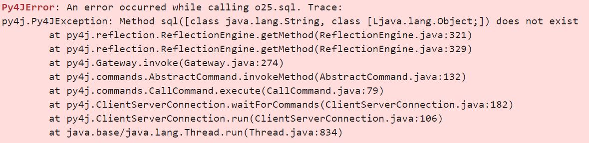

### First look at Spark

** import spark **
```import pyspark
from pyspark.sql import SparkSession
```

** Read files **
``` df = spark.read \
    .option("header", "true") \
    .csv('fhvhv_tripdata_2021-01.csv')
```

** Change schema **
1. Create spark dataframe
``` spark.createDataFrame(df_pandas).schema ```

2. Save the desire schema to variable
``` from pyspark.sql import types 
    schema = types.StructType([
        types.StructField('hvfhs_license_num', types.StringType(), True), 
    types.StructField('dispatching_base_num', types.StringType(), True), 
    types.StructField('pickup_datetime', types.TimestampType(), True), 
    types.StructField('dropoff_datetime', types.TimestampType(), True), 
    types.StructField('PULocationID', types.LongType(), True), 
    types.StructField('DOLocationID', types.LongType(), True), 
    types.StructField('SR_Flag', types.StringType(), True)
    ])
```
    - Have to add types. before the StructType, StructField and StringType

3. Import the data again with added schema arguments
```
df = spark.read \
    .option("header", "true") \
    .schema(schema) \
    .csv('fhvhv_tripdata_2021-01.csv')
```
`ctrl + d` - select whole current word
`ctrl + shift + l` - select multiple words with same occurance in visual studio

** Partition into n files **
``` df = df.repartition(24) ```

** Write to local **
``` df.write.parquet('fhvhv/2021/01/') ```

### Spark Dataframes
#### Actions vs Transformations
** Transformations -lazy （Not executed immediately) **  
- Selecting columns
- Filtering
- Join
- Group by

** Actions -eager （Executed immediately) ** 
- Show, take, head
- Write

#### Using SQL Functions in Spark
- Import the package
`from pyspark.sql import functions as F` 

- Add new column in Spark
`df.withColumn(new, func)`

- To use df in spark.sql, first need to register the table
`df.registerTempTable('df_sql')`

#### Starting Spark Locally
** Window **
cd %SPARK_HOME%
bin\spark-class2.cmd org.apache.spark.deploy.master.Master

http://localhost:8080/

cd %SPARK_HOME%
bin\spark-class2.cmd org.apache.spark.deploy.worker.Worker -c 1 -m 4G spark://YOUR_IP_ADDRESS:7077

``` 
spark-submit \
    --master="${URL}" \
    06_spark_sql.py \
    --input_green=data/pq/green/2021/*/ \
    --input_yellow=data/pq/yellow/2021/*/ \
    --output=data/report-2021 
```
Starting Spark

#### Google Dataproc
```
gcloud dataproc jobs submit pyspark \
    --cluster=cluster_name \
    --region=region \
    gs://bucket/code/06_spark_sql.py \
    -- \
    --input_green=gs://bucket/pq/green/2020/*/ \
    --input_yellow=gs://bucket/pq/yellow/2020/*/ \
    --output=gs://bucket/report-2020
```
Submit job via CLI https://cloud.google.com/dataproc/docs/guides/submit-job#dataproc-submit-job-gcloud

#### Google Dataprocc to Bigquery
```
gcloud dataproc jobs submit pyspark \
    --cluster=cluster_name \
    --region=region \
    gs://bucket/code/06_spark_sql_bigquery.py \
    -- \
    --input_green=gs://bucket/pq/green/2020/*/ \
    --input_yellow=gs://bucket/pq/yellow/2020/*/ \
    --output=trips_data_all.report-2020
```

#### Debugging
When running on window and jupyter notebook, the udf function might return error as shown below

This problem is caused by the connection between pyspark and python.
To solve this, has to change the PYSPARK_DRIVER_PYTHON and variable.
The following is done in Git Bash.
` set PYSPARK_PYTHON=python ` 
Or add the variable into system variables.  


There might be an error happens when running spark.sql

This is caused by incompatible verison of spark and pyspark.
The one used in this project is as follow:
   - python 3.11.8
   - hadoop 3.3.0 with winutils from https://github.com/Stephenlaye2/winutils3.3.0/tree/master/hadoop-3.3.0/bin
   - pyspark 3.5.1
   - spark 3.5.1
   - scala 2.12.18
   - Java HotSpot(TM) 64-Bit Server VM, 11.0.22 